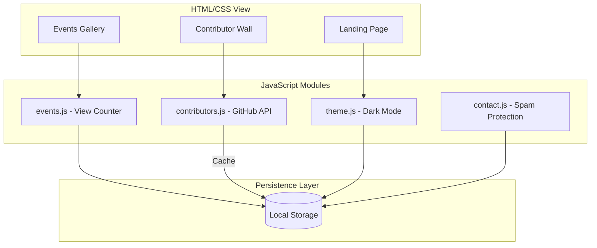

# Pixel Phantoms – Official Website 👻


<div align="center">

[](https://github.com/sayeeg-11/Pixel_Phantoms/blob/main/CONTRIBUTING.md)
[](https://github.com/sayeeg-11/Pixel_Phantoms/blob/main/LICENSE)
[](https://opensource.org/)

## A beginner-friendly, responsive, open-source platform for learning and collaboration
</div>

## 📋 Table of Contents

- 🎯 [ Project Overview](#-project-overview)
- 🌟 [ Why This Project Matters](#-why-this-project-matters)
- 🛠  [ Tech Stack](#-tech-stack)
- 📦 [Installation & Local Setup](#-installation--local-setup)
- 🔧 [ Code Formatting & Linting](#-code-formatting--linting)
- 🤝 [How to Contribute](#-how-to-contribute)
- 📁 [ Project Structure](#-project-structure)
- 🎨 [Screenshots & Demo](#-screenshots--demo)
- 🗺️ [Project Roadmap](#-project-roadmap)
- 📝 [ Issues](#-issues)
- 📌 [License](#-license)
- 👥 [ Core Committee (2024–25)](#-core-committee-202425)
- 🔥 [ Contributors](#-contributors)
- 📫 [Contact](#-contact)

---

## 🎯 Project Overview

The **Pixel Phantoms Official Website** serves as the central digital hub for the Pixel Phantoms student-driven tech community. This platform not only showcases community initiatives but also functions as a real-world, beginner-friendly open-source codebase for hands-on learning.

### Key Features:
- 📢 Showcases the Pixel Phantoms community and its activities
- 📅 Highlights events, workshops, achievements, and member projects
- 👥 Presents the core committee and recruitment details
- 🎓 Encourages learning, collaboration, and open-source contributions
- 🌐 Fully responsive design for all devices

> **Note:** Open to students, beginners, and open-source contributors worldwide!

---

## 🌟 Why This Project Matters

- 🎯 **Beginner-Friendly Environment** – Perfect for first-time open-source contributors
- 💻 **Hands-On Learning** – Practical experience with modern frontend development
- 🤝 **Collaborative Workflows** – Learn Git, issues, PRs, and code reviews
- 🏗️ **Real-World Structure** – Industry-standard project organization
- 🎨 **UI/UX Development** – Opportunities to enhance design and responsiveness skills

---

## 🛠 Tech Stack

### Core Technologies:

| Category | Tools |
| :--- | :--- |
| **Core** | HTML5, CSS3, Vanilla JavaScript (ES6+) |
| **UI & Animation** | Bootstrap, GSAP, AOS, jQuery |
| **Dev Tooling** | Husky, Lint-staged, Prettier, ESLint |
| **External APIs** | GitHub REST API, GitHub Calendar |

### 🔧 Page Transitions (Issue #519)
We've added an optional, performant page transition system using CSS + Vanilla JS to improve navigation UX across the site.
**Highlights:**
- Fade + subtle slide transitions (300ms default)
- Respects users' prefers-reduced-motion setting
- Works without JS (graceful degradation)
- Optional loading indicator for slow fetches
**Files added/updated:**
- `css/animations.css` (new)
- `js/page-transitions.js` (new)
- Updated page wrappers: `index.html`, `about.html`, `contact.html`, `events.html`, `pages/*.html`
- Init added to `js/main.js`

To customize: change `--page-transition-duration` in CSS or pass options to `PageTransitions.init({ duration, type, scrollToTop, showLoadingIndicator })`.

### Optional Add-ons:
- **Bootstrap** – Responsive framework
- **AOS Animations** – Scroll animations
- **jQuery** – Simplified JavaScript
- **API Integrations** – External data fetching

---

## System Architecture



---

## ⚙️ Core Logic & Integration

### �️ Event View Tracking
Our events page features a **client-side view counter** that tracks event popularity:

**How It Works:**
- Uses browser **localStorage** for persistent tracking
- Increments when an event card is clicked
- **3-second debounce** prevents spam clicks
- Data persists across browser sessions

**Features:**
- 📊 Per-event tracking with unique IDs
- 🔢 Human-readable formatting (1.2K, 1.5M views)
- 🛡️ Prevents abuse with timestamp checks
- 💾 Works completely offline (no backend required)

**Data Storage Format:**
```json
{
  "event-1": {"count": 123, "lastView": 1234567890},
  "event-2": {"count": 456, "lastView": 1234567891}
}
```

### � GitHub Integration
The contributors page now features **live GitHub integration** to showcase team member activity and contributions!

#### 📊 Contributor Stats
- **Public Repos:** Displays total public repositories
- **Followers & Following:** Shows GitHub network stats
- **Cached Data:** Results cached for 24 hours in localStorage
- **Rate Limiting:** 60 API requests/hour (unauthenticated)
- **Graceful Fallbacks:** Shows cached data if API limits are exceeded

#### 📈 Contribution Graph
- **Yearly Heatmap:** Powered by [github-calendar](https://github.com/IonicaBizau/github-calendar) library
- **Responsive Design:** Mobile-friendly contribution visualization
- **Activity Insights:** See daily contribution patterns at a glance

#### 🔧 Adding New Contributors
To display GitHub stats for a contributor:
1. Add `data-github="username"` attribute to contributor card
2. Replace `username` with their actual GitHub username
3. Stats will automatically populate on page load

```html
<div class="contributor-card" data-github="SujalTripathi">
  <!-- Stats auto-populate here -->
</div>
```

#### ⚡ Technical Details
- Uses **GitHub REST API** (no authentication required for public data)
- Fetches: repos, followers, following, recent projects
- **Error Handling:** Network failures, rate limits, missing profiles
- **Performance:** Parallel API requests with caching strategy

---

## 🛡️ Security & Performance

- The contact form includes a hidden honeypot field named `website` (bots often fill this).
- Client-side rate limiting is enabled (5 seconds between submissions) using `localStorage`.
- No server configuration or API keys are required.

**Testing:** Fill the hidden `website` field or submit repeatedly to see the "Spam detected" and rate limit messages.

---

## �📦 How to Install & Run Locally

### Prerequisites

- 🌐 Modern web browser (Chrome, Firefox, Safari, or Edge)
- 🐙 **Git** – Required for cloning the repository
- ⚙️ **Node.js (v16+)** and **npm** – For development tooling
- 💡 **VS Code** with Live Server extension (Recommended)

### Step-by-Step Setup
1. **Clone the Repository**
   ```bash
   git clone https://github.com/sayeeg-11/Pixel_Phantoms.git
   cd Pixel_Phantoms
   ```
2. **Install Dependencies (Recommended for contributors)**
    ```bash
    npm install
    ```
**Run the Website Locally**

**✅ Option 1: Live Server (Recommended)**
1. Open project in VS Code
2. Right-click index.html
3. Select "Open with Live Server"
4. Access at  **`http://127.0.0.1:5500/`**

**⚠️ Option 2: Direct Browser Access**
1. Open `index.html` directly in browser
> Note: Some JavaScript features may not work due to CORS

### 🔧 Code Formatting & Linting
This project uses automated tools to maintain code quality:
**Available Commands:**
#### Formatting
```
npm run format          # Format all files
npm run format:check    # Check formatting without changes
```
#### Linting
```
npm run lint           # Check for linting issues
npm run lint:fix       # Fix linting issues automatically
```

**Pre-commit Hooks:**
* 🛡️ Husky and lint-staged automatically run checks before commits
* 🔒 Commits are blocked if formatting/linting checks fail
* ✅ Ensures consistent code quality across all contributions

<hr>

## 🤝 How to Contribute
We welcome all contributions – design updates, animations, UI fixes, new pages, and more!

**Contribution Workflow:**
Before Starting:
1. Create an Issue describing your proposed change
2. Wait for admin to assign the issue to you
3. Discuss implementation details if needed

**Development Steps:**
### 1. Fork the repository
### 2. Clone your fork
```
git clone https://github.com/your-username/pixel-phantoms-website.git
```
### 3. Create feature branch
```
git checkout -b feature-name
```
### 4. Make changes and commit
```
git commit -m "Add: short feature description"
```
### 5. Push to your fork
```
git push origin feature-name
```

**Submit Pull Request:**
1. Open a Pull Request from your branch
2. Reference the related issue
3. Wait for review and feedback

**👉 Detailed guidelines: CONTRIBUTING.md**
<hr>

<details>

<summary>
  <h2> 📁 Project Structure</h2>
  <p>Click to view the project structure</p>
</summary>

```text
pixel-phantoms-website/
│
├── index.html              <-- Main Landing Page
├── about.html              <-- About Us Page
├── contact.html            <-- Contact Form (Logic: js/contact.js)
├── events.html             <-- Events Gallery (Logic: js/events.js)
│
├── pages/                  <-- Secondary Pages
│   ├── community.html      <-- Logic: js/community.js
│   ├── contributors.html   <-- Logic: js/contributors.js
│   ├── gallery.html        <-- Logic: js/gallery.js
│   ├── join-us.html        <-- Logic: js/join-us.js
│   └── projects.html       <-- Logic: js/projects.js
│
├── js/                     <-- Core Logic & Modules
│   ├── main.js             <-- Global Init (Transitions & Orchestration)
│   ├── theme.js            <-- Dark/Light Mode Management
│   ├── navbar.js           <-- Navigation & Mobile Menu logic
│   ├── page-transitions.js <-- Smooth Page Swapping (Issue #519)
│   └── ...
│
├── css/                    <-- Component-specific Styling
│   ├── style.css           <-- Global Styles
│   ├── animations.css      <-- Transitions & Keyframes
│   └── ...
│
├── data/
│   └── events.json         <-- Backend-simulated Event Data
│
└── assets/                 <-- Images, SVGs, and Branding
```
</details>

<details>
  <summary>
    <h2>🎨 Screenshot / Demo</h2>
    <p>Click to view screenshots of the Pixel Phantoms website</p>
  </summary>

  <br/>

  <h3>🏠 Home Page</h3>
  

  <hr/>

  <h3>🪪 Logo</h3>
  

  <hr/>

  <h3>🖼️ Additional Images</h3>

  <p align="center">
    
    
    
  </p>

  <p align="center">
    
    
    
  </p>

</details>


---

## 🗺️ Project Roadmap

✅ Completed |🚧 In Progress |🔮 Coming Soon
|---|---|---|
Basic UI setup | Events Page | Dark / Light mode
Home, About, Contact pages | Projects showcase | Blog section
Core committee section | Mobile responsiveness improvements | Student portfolio integration
Navbar & footer components| |

---

## 📝 Issues

Found a bug?
Have an idea?
👉 Open an **Issue** with the correct labels.

---

## 📌 License

This project is licensed under the **MIT License**.
See the full license in the [`LICENSE`](LICENSE) file.

---

## 👥 Core Committee (2024–25)

| Role | Name |
| :--- | :--- |
| **Director** | Prathamesh Wamane |
| **President** | Krishna Shimpi |
| **Vice President** | Pratik Thorat |
| **Technical Head** | Harsh Pawar |
| **Treasurer** | Ayush Patil |
| **Event Head** | Laxmi Shingne |
| **Project Manager** | Krushna Gite |
| **Recruitment Head** | Pallavi Thote |
| **Web Development Lead** | Pushkar Thakare |
| **Design Head** | Shruti Gaikwad |
| **Embedded System Lead** | Diksha Rakibe |
| **Social Media & Branding Head** | Rushabh Pekhale |
| **Media & Publicity Head** | Sarvesh Aher |
| **Mentors** | Sayee Gosavi, Mohit Jagtap |

---

## �🔥 Contributors

Thanks to all the amazing contributors who make this project better every day! 💖

<a href="https://github.com/sayeeg-11/Pixel_Phantoms/graphs/contributors">
  
</a>

**👉 See the full [contribution graph](https://github.com/sayeeg-11/Pixel_Phantoms/graphs/contributors)**  


---

## 📫 Contact

**Admin:**  
**Sayee Gosavi**

- 📧 Email: [sayeeygosavi@gmail.com](mailto:sayeeygosavi@gmail.com)
- 💻 GitHub: [sayeeg-11](https://github.com/sayeeg-11)
- 🔗 LinkedIn: [Sayee Gosavi](https://www.linkedin.com/in/sayee-gosavi11/)
- 📍 Location: Nashik, Maharashtra

> Let’s build something amazing together! 🚀👻


